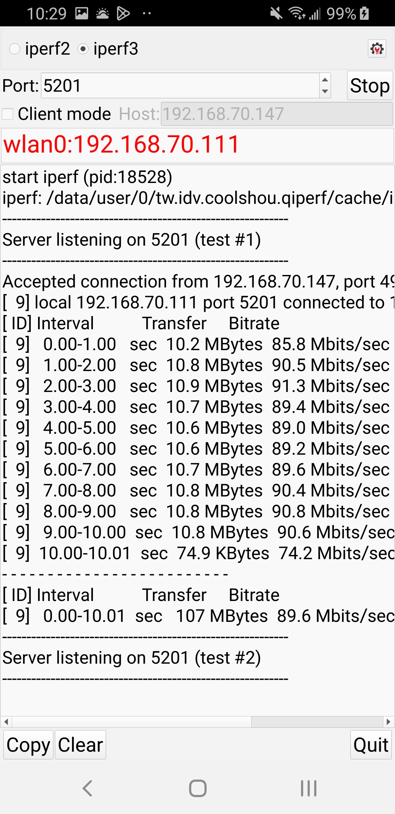

# qiperf

A simple qt base app to lunch iperf2/3 in client/server mode

# Requirement
 * qtbase5-dev
 * Qt MaintenanceTool to install android support

# Screenshot

# Support
 * Linux
 * Android
 * Windows (x64)

# TODO
 * get new apk from internet and update it
 * when ip address changed => update UI
 * add Mac OS support
 * add iOS support
 * add Control UI to control multi-iperf at once (like IxChariot)
 * add Control UI with throughput chart
 