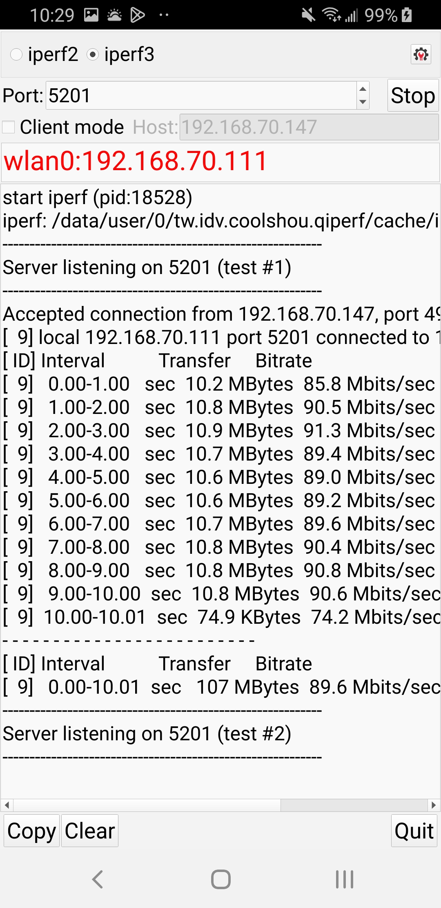

# qiperf

Quick iperf control tool

# Requirement
 * qt5-qmake | qmake6
 * qtbase5-dev | qt6-base-dev,
 * libqt5websockets5-dev | libqt6websockets6-dev | qt6-websockets-dev
 * libqt5serialport5-dev | libqt6serialport6-dev | qt6-serialport-dev
 * qtwebengine5-dev | qt6-webengine-dev,
 * qtbase5-private-dev | qt6-base-private-dev
 * libsystemd-dev
 * QCustomPlot
 * Qt MaintenanceTool to install android support
# Install

## Ubuntu 24.04:
```
sudo apt install libqt6positioning6 libqt6quickwidgets6 libqt6serialport6 \
  libqt6webchannel6 libqt6webengine6-data libqt6webenginecore6 \
  libqt6webenginecore6-bin libqt6webenginewidgets6 \
  libqt6websockets6
```
## Ubuntu 22.04:
```

```

# Build
```
    sudo apt install libsystemd-dev cmake libbotan-2-dev
    # use qt5
    export QT_SELECT=qt5
    sudo apt install qt5-qmake qtbase5-dev libqt5websockets5-dev libqt5serialport5-dev qtwebengine5-dev qtbase5-private-dev
    # use qt6
    export QT_SELECT=qt5
    sudo apt install qmake6  qt6-base-dev libqt6websockets6-dev libqt6serialport6-dev qt6-webengine-dev qt6-base-private-dev
   git clone https://github.com/coolshou/qiperf
   cd qiperf
   git submodule init
   git submodule update
   ###################
   # geographiclib
   cd lib/geographiclib
   mkdir build
   cd build
   # linux
   cmake -DBUILD_SHARED_LIBS=OFF
   make
   # windows (require VC 2022 )
   cmake -DBUILD_SHARED_LIBS=OFF -DCMAKE_CXX_FLAGS="/EHsc /wd4819  /wd4456  /wd4244 /WX-"  ..
   msbuild -p:Configuration=Release GeographicLib.sln 
   cd ../../../
   ###################
   # QSsh
   cd lib/qssh
   git submodule init
   git submodule update
     ###################
     # botan
     cd botan
     #  botan (windows, python <=3.11)
     python configure.py --cc=msvc --os=windows --cpu=x64
     nmake
     # linux 
     python3 ./configure.py --disable-shared-library
     make
     cd ..
     ###################
   qmake
   make
   cd ../../
   # build qiperfc, qiperfd and qiperftray
   build_x64.bat or ./build_deb.sh
```
# qiperfd
Quick iperf daemon

# qiperftray
Quick iperf tray

[]("images/Screenshot_2.jpg")
# qiperfc
Quick iperf console

# Build
## ubuntu 24.04:
```
sudo apt install libglut-dev libsystemd-dev
sudo apt install qmake6 qt6-base-dev  qt6-websockets-dev qt6-serialport-dev qt6-webengine-dev qt6-base-private-dev libqt6core5compat6-dev
./build_deb.sh
```
## build pdeb ackets for ubuntu 22.04 by Dockerfile.ubuntu22.04:
```
# build ubuntu 22.04 qt5 image
docker build -t ubuntu-qt5:22.04 -f Dockerfile.ubuntu22.04 .

# run it

docker run --name ubuntu2204-qt5  -it \
    --rm \
    --network host \
    -v /home/jimmy/SOFT/work/qiperf:/media/qiperf \
    ubuntu-qt5:22.04 /bin/bash


cd /media/qiperf
./build_deb-qt5.sh
```

# cross-compile for Raspberry 3 (aarch64)
	sudo dpkg --add-architecture arm64
	sudo apt update
	sudo apt-get install build-essential crossbuild-essential-arm64
	cd qiperf
	dpkg-buildpackage -us -uc -b --host-arch arm64

sbuild --host=armhf

## Windows
	requirement
	Qt
	Visual Studio 2022 Community


# Support

* Linux
* Android
* Windows (x64)

# iperf3:

    Android binary:  https://github.com/davidBar-On/android-iperf3

# TODO

* get new apk from internet and update it
* when ip address changed => update UI
* add Mac OS support
* add iOS support
